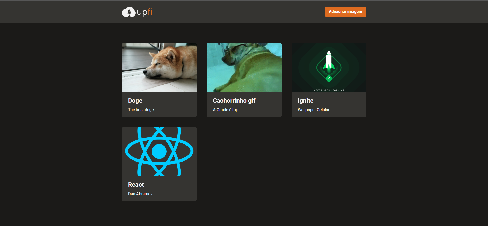

<h1 align="center">
   </> upfi | Conteúdo Prático - Ignite ReactJS [Módulo 04]
</h1>

<br/>

## 💻 Projeto
 Essa aplicação demonstra uma plataforma que realiza upload de imagens, que funciona como um repositório de foto online, com um layout simples e sugestivo essa aplicação contém um formulário para cadastro de novas imagens, um modal que permite ampliar a imagem clicada e disponibiliza um link para acessa-la no tamanho original e também um botão que faz a páginação dos coteúdos com o conceito de scroll infinito, ou seja, se houverem mais dados basta clicar no botão para npvas imagens serem renderizadas em tela.

## 🔖 Layout
 O layout pode ser acessado através do Figma, basta [clicar aqui](https://www.figma.com/file/qSmodBM3onNu30AZ3d0vsy/upfi---ignite-%5Bm%C3%B3dulo-04%5D?node-id=0%3A1)

 <h1 align="center">
    
</h1>


 ## 🚀 Tecnologias

- [NextJS](https://nodejs.org/en/)
- [ReactJS](https://reactjs.org)
- [Typescript](https://www.typescriptlang.org/)
- [Chakra UI](https://chakra-ui.com/)
- [FaunaDB](https://fauna.com/)


### 📡 Ferramentas Complementares

- [React Query](https://react-query.tanstack.com/)
- [React Form Hook](https://react-hook-form.com/)
- [Prettier](https://prettier.io/)
- [Eslint](https://eslint.org/)

<br/>


## 🤔 Como posso interagir com projeto?

- Para instalar localmente, siga os passos abaixo:

<br/>

```sh
git clone https://github.com/ManuelMolina02/up-fi.git
```

Após baixar o projeto, acesse o repositório via terminal e execute os seguintes comandos:

```sh
yarn install
yarn dev
```

<br/>
<br/>

Feito com 💜 por Manuel Molina 👋 Me contate através do [LinkedIn!](https://www.linkedin.com/in/manuel-angel-berger-molina-ba08b3174/)
